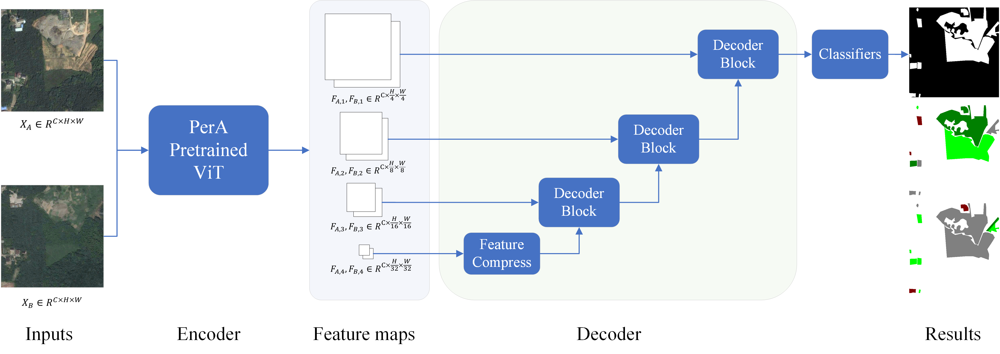
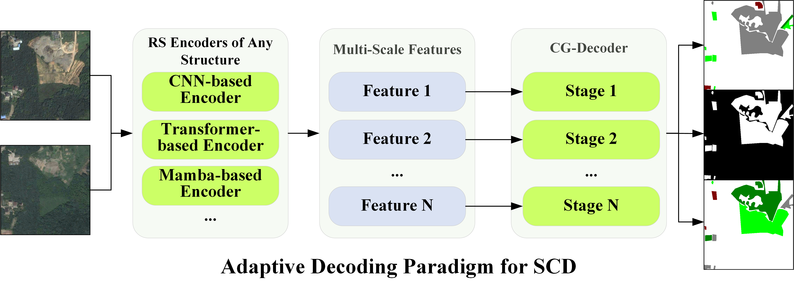

# PerASCD: Plug-and-Play Semantic Change Detection Framework

<p align="center">
  
</p>

<p align="center">
  <a href="https://arxiv.org/abs/2602.13780"></a>
  <a href="#"></a>
  <a href="#"></a>
  <a href="#"></a>
  <a href="#"></a>
</p>

> Official implementation of **PerASCD**, a semantic change detection framework with a plug-and-play encoder interface and a cascade gated decoder. See paper for more details: [Foundation Model-Driven Semantic Change Detection in Remote Sensing Imagery](https://arxiv.org/abs/2602.13780).

---

## News

- `[25 May 2026]` Code released.
- `[14 Feb 2026]` Paper uploaded to arXiv.

---

## Overview

Semantic Change Detection aims to identify changed regions between bi-temporal remote sensing images and predict their semantic categories before and after the change.

This repository provides:

- A unified training pipeline for semantic change detection.
- Multiple encoder backbones, including `PerA`, `VMamba-B`, `SwinV2-L`, and `ResNet50`.
- A Cascade Gated Decoder for multi-scale feature fusion.
- Support for `SECOND` and `LandsatSCD` datasets.
- Easy extension for custom encoders.

---

## Framework

The proposed **Cascade Gated Decoder (CG-Decoder)** is designed for semantic change detection with plug-and-play multi-scale encoders. It progressively integrates hierarchical semantic features from deep to shallow stages while explicitly modeling semantic changes between bi-temporal inputs.

<p align="center">
  
</p>

Each **CG-Decoder Block** progressively refines bi-temporal semantic features and change features by combining deep decoded representations with shallower encoder features through feature compression, difference modeling, and change-aware gated fusion.

<p align="center">
  
</p>

---

## Installation

### 1. Create environment

```bash
conda create -n perascd python=3.10 -y
conda activate perascd
```

### 2. Install dependencies

```bash
pip install -r requirements.txt
```

### 3. Build custom CUDA ops for PerA / ViT-Adapter
This step is only required if you want to use the `PerA` encoder.  
If you only use other backbones such as `ResNet50`, `VMamba-B`, or `SwinV2-L`, you can skip this step.

Build `MultiScaleDeformableAttention`:

```bash
cd models/pera_layers/vit_adapter_layers/ops
sh make.sh
cd -
```

---

## Dataset Preparation

We provide processed datasets with single-channel `uint8` index labels.

| Dataset | Download |
|---|---|
| SECOND | [Download](YOUR_SECOND_DATASET_LINK) |
| LandsatSCD | [Download](YOUR_LANDSAT_SCD_DATASET_LINK) |

Expected directory structure:

```text
SECOND/
├── train/
│   ├── im1/
│   ├── im2/
│   ├── label1/
│   └── label2/
└── val/
    ├── im1/
    ├── im2/
    ├── label1/
    └── label2/
```

For other datasets, the structure is similar, but the directory structure should be consistent.

Each label should be a single-channel `uint8` index map:

```text
0: unchanged / ignored
1~N: semantic classes
```
---

## Training

### Train PerASCD (PerA backbone + CG-Decoder)

```bash
CUDA_VISIBLE_DEVICES=0 python train.py \
  --encoder pera \
  --pretrained-path /path/to/pera_pretrained.params \
  --data-name SECOND \
  --data-path /path/to/SECOND \
  --train-batch-size 4 \
  --val-batch-size 4 \
  --grad-accum-steps 2 \
  --note pera_second
```

### Train VMamba-B backbone + CG-Decoder

```bash
CUDA_VISIBLE_DEVICES=0 python train.py \
  --encoder vmambaB \
  --pretrained-path /path/to/vmamba_base.pth \
  --data-name SECOND \
  --data-path /path/to/SECOND \
  --train-batch-size 8 \
  --val-batch-size 8 \
  --grad-accum-steps 1 \
  --note vmamba_second
```

Other backbones can be used by replacing `--encoder` with the appropriate name.

### Custom Encoder

To add a new encoder, create a new file under `models/`, for example:

```text
models/my_encoder.py
```

Each encoder file should implement:

```python
def build_model(num_classes, input_size, output_size, drop_rate, pretrained_path=None, freeze_backbone=False):
    encoder = build_encoder(drop_rate, pretrained_path, freeze_backbone)  # Your encoder implementation here
    return SCDNet(
        encoder=encoder,
        in_channel_list=[128, 256, 512, 1024],
        num_classes=num_classes,
        output_size=output_size,
        drop_rate=drop_rate,
        out_channels=128,
    )
```

The encoder should output a list of multi-scale features:

```python
features = [f1, f2, f3, f4]
```

where the resolution is usually:

```text
f1: 1/4
f2: 1/8
f3: 1/16
f4: 1/32
```

Then register it in `train.py`:

```python
ENCODER_REGISTRY = {
    "pera": "models.pera",
    "vmambaB": "models.vmamba",
    "resnet50": "models.resnet",
    "swinV2L": "models.swin",
    "myEncoder": "models.my_encoder",
}
```

Do not forget to set the correct normalization profile for your encoder in `utils/dataset.py`.  
Different pretrained encoders may require different input normalization statistics.

```python
NORM_PROFILES = {
    "imagenet": {
        "mean": (0.485, 0.456, 0.406),
        "std": (0.229, 0.224, 0.225),
    },
    "pera": {
        "mean": (0.3585, 0.3741, 0.3155),
        "std": (0.1483, 0.1283, 0.1198),
    },
}
```

Then update the encoder-to-normalization mapping:

```python
ENCODER_TO_NORM = {
    "pera": "pera",
    "vmambaB": "imagenet",
    "resnet50": "imagenet",
    "swinV2L": "imagenet",
    "myEncoder": "imagenet",  # Change this if your encoder uses another normalization profile.
}
```

For example, if your custom encoder is pretrained with ImageNet statistics, use:

```bash
--norm-profile imagenet
```
---

## Evaluation

Validation is automatically performed after each training epoch.

The checkpoint name contains the main metrics:

```text
encoder_XXe_mIoUXX.XX_SekXX.XX_FscdXX.XX_OAXX.XX.pth
```

Example:

```text
pera_22e_mIoU86.59_Sek53.83_Fscd86.43_OA95.21.pth
```

---

## Results

### SECOND

| Method | Backbone | mIoU | Sek | Fscd | OA | Checkpoint |
|---|---|---:|---:|---:|---:|---|
| ResNet50 + CG-Decoder | ResNet50 | XX.XX | XX.XX | XX.XX | XX.XX | [Download](YOUR_SECOND_RESNET50_CKPT_LINK) |
| SwinV2-L + CG-Decoder | SwinV2-L | XX.XX | XX.XX | XX.XX | XX.XX | [Download](YOUR_SECOND_SWINV2L_CKPT_LINK) |
| VMamba-B + CG-Decoder | VMamba-B | XX.XX | XX.XX | XX.XX | XX.XX | [Download](YOUR_SECOND_VMAMBAB_CKPT_LINK) |
| **PerASCD** | PerA / DINOv2-G | **XX.XX** | **XX.XX** | **XX.XX** | **XX.XX** | [Download](YOUR_SECOND_PERASCD_CKPT_LINK) |

### LandsatSCD

| Method | Backbone | mIoU | Sek | Fscd | OA | Checkpoint |
|---|---|---:|---:|---:|---:|---|
| ResNet50 + CG-Decoder | ResNet50 | XX.XX | XX.XX | XX.XX | XX.XX | [Download](YOUR_LANDSAT_RESNET50_CKPT_LINK) |
| SwinV2-L + CG-Decoder | SwinV2-L | XX.XX | XX.XX | XX.XX | XX.XX | [Download](YOUR_LANDSAT_SWINV2L_CKPT_LINK) |
| VMamba-B + CG-Decoder | VMamba-B | XX.XX | XX.XX | XX.XX | XX.XX | [Download](YOUR_LANDSAT_VMAMBAB_CKPT_LINK) |
| **PerASCD** | PerA / DINOv2-G | **XX.XX** | **XX.XX** | **XX.XX** | **XX.XX** | [Download](YOUR_LANDSAT_PERASCD_CKPT_LINK) |

---

## Citation

If this work is useful for your research, please consider citing:

```bibtex
@article{your2026perascd,
  title   = {PerASCD: A Plug-and-Play Framework for Semantic Change Detection},
  author  = {Your Name and Coauthors},
  journal = {XXX},
  year    = {2026}
}
```
---


## License

This project is released under the `MIT License`.

---

## Contact

For questions or suggestions, please contact:

```text
Your Name
your.email@example.com
```